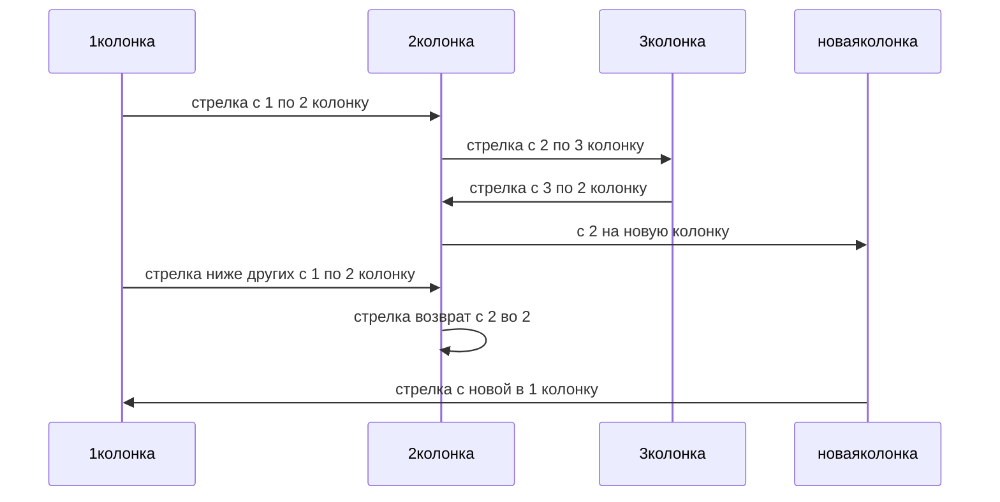
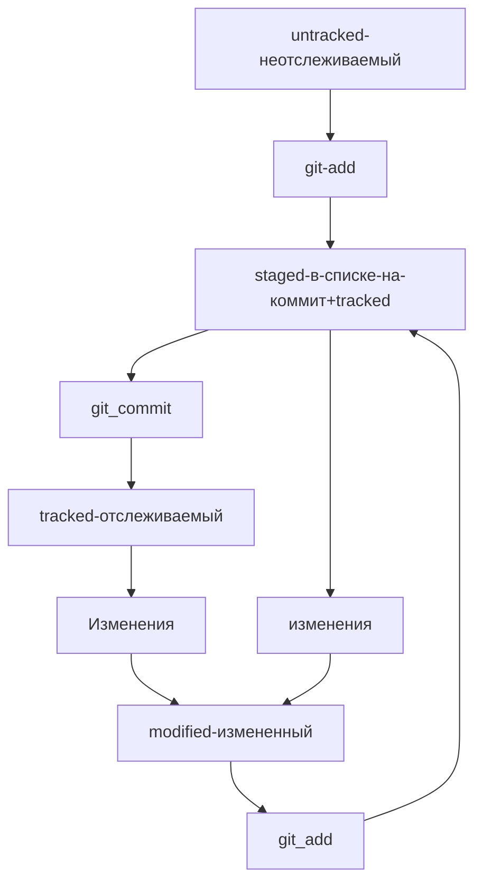

```mermaid
  sequenceDiagram
    participant 1колонка
    participant 2колонка
    participant 3колонка
    1колонка->>2колонка: стрелка с 1 по 2 колонку
    2колонка->>3колонка: стрелка с 2 по 3 колонку
    3колонка->>2колонка: стрелка с 3 по 2 колонку 
    2колонка->>новаяколонка: с 2 на новую колонку
    1колонка->>2колонка: стрелка ниже других с 1 по 2 колонку
    2колонка->>2колонка: стрелка возврат с 2 во 2
    новаяколонка->>1колонка: стрелка с новой в 1 колонку  
```

```mermaid
  graph TD;
    untracked-неотслеживаемый-->git-add-->staged-в-списке-на-коммит+tracked;
    modified-измененный-->git_add-->staged-в-списке-на-коммит+tracked-->git_commit-->tracked-отслеживаемый-->Изменения-->modified-измененный;
    staged-в-списке-на-коммит+tracked-->изменения-->modified-измененный;
```
