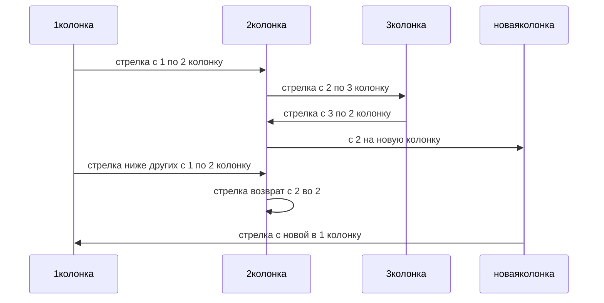
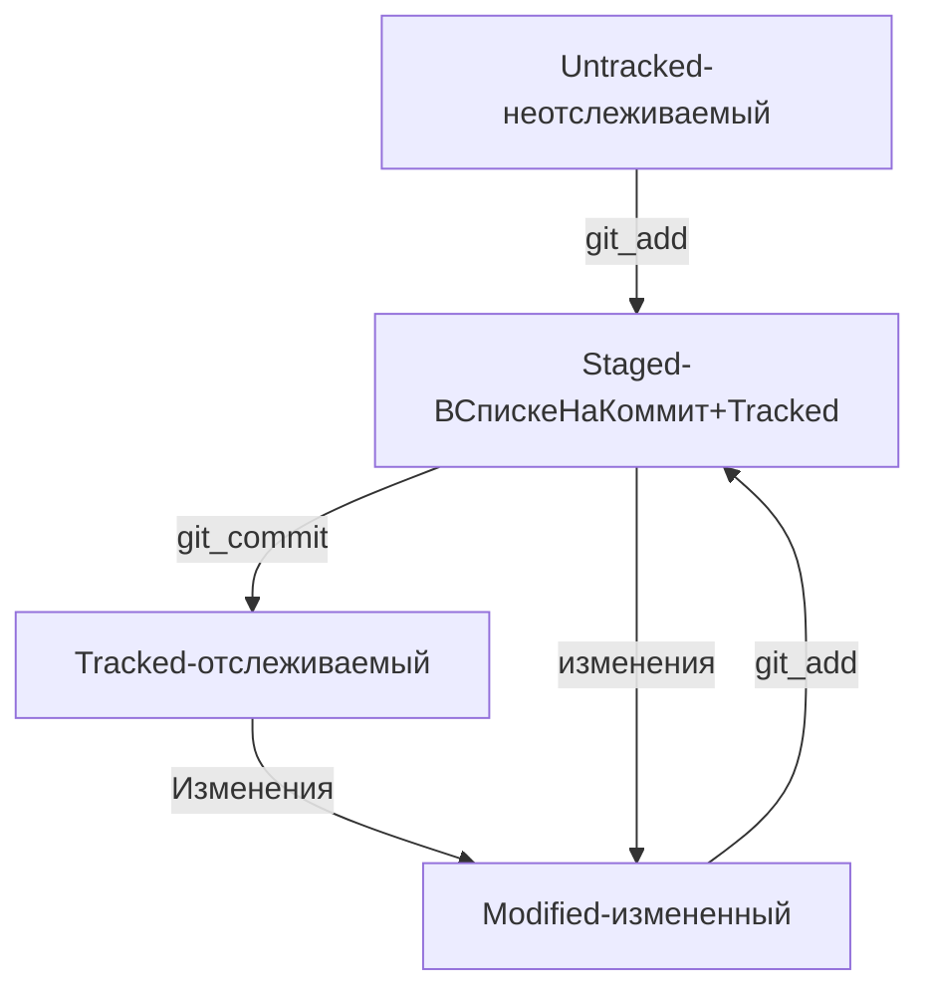

[Ссылка на описание создание диаграмм](https://github.blog/developer-skills/github/include-diagrams-markdown-files-mermaid/ "Кликни по ссылке, для перехода на сайт с описанием диаграмм")  

Два символа %% обозначают в mermaid строку-комментарий.
Чтобы сделать схему, нужно указать формат: graph LR. Graph — это простейший тип схем; для шпаргалки его будет достаточно.
Чтобы добавить элементы и связи (стрелки), используют строки вида A --> B. Такая строка создаст квадратные блоки А и B и соединит их стрелкой.
Дополнительно можно указывать текст на стрелке. Например, так: A -- "text" --> B
